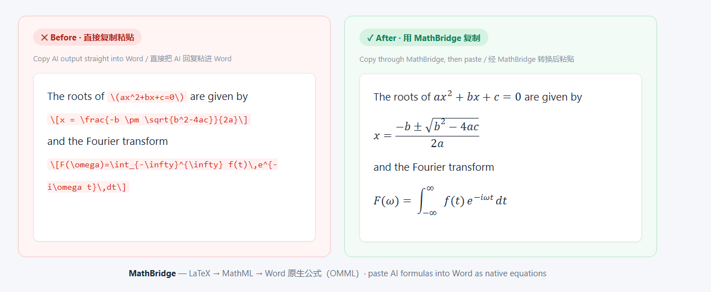
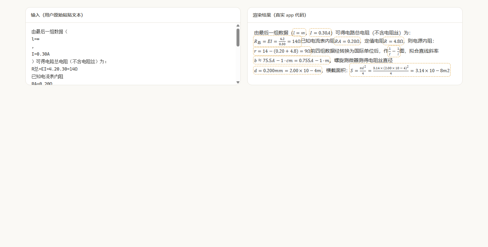

# MathBridge · AI Formula Translator

**[简体中文](README.zh-CN.md)** | English

Paste AI-generated LaTeX formulas into **Word / WPS as native, editable equations** — no more garbled code.

**[🚀 Live Demo](https://polaris929-cloud.github.io/MathBridge-AI-Formula-Translation/)**



Smart mode in action — plain text copied from an AI chat (left) is reconstructed into compact, properly stacked formulas (right):



## Why it exists

When ChatGPT / Claude / DeepSeek writes math, the output is LaTeX source like `$E = mc^2$`. Copy-pasting that into Word gives you either raw backslash-laden source text or flattened garbage.

MathBridge fixes the pipeline:

```
AI LaTeX output  →  MathML  →  system clipboard (text/html)  →  Word auto-converts to native equation (OMML) on paste
```

What lands in Word is a **real equation object** — double-click to edit, flows with your document, identical to an equation inserted by hand.

## Usage

1. Open `index.html` (or the deployed page)
2. Paste the AI reply into the left input box
3. The right pane renders a live preview
4. Click **Copy to Word** (or Ctrl + Enter), then Ctrl + V in Word / WPS

Click any **single formula block** in the preview to copy just that formula.

## Features

- **Zero upload** — all conversion happens locally in the browser; formulas never touch a server
- **Zero-dependency deploy** — pure static files, Temml engine bundled in `assets/vendor/`, works fully offline
- **Mixed parsing** — auto-detects `$...$` inline and `$$...$$` / `\[...\]` display formulas, mixed with regular text
- **Smart Unicode detection** — plain text copied from AI chats is reconstructed automatically: soft line-breaks merged, Unicode symbols & super/subscripts restored, flattened fractions rebuilt (e.g. `4.20.30` becomes a proper fraction)
- **Rich paste** — when the clipboard HTML contains KaTeX MathML (DeepSeek, Kimi, ChatGPT…), the original LaTeX source is extracted for zero-loss conversion
- **Compact layout** — inline formulas stay in the same paragraph as the surrounding text, matching the original AI reply
- **Fault tolerant** — a formula that fails to parse is highlighted in red without blocking the rest
- **Bilingual UI** — Chinese / English toggle, remembered via localStorage
- **Customizable appearance** — font size, font weight, background color, panel height and corner radius, all persisted locally
- **No framework** — vanilla HTML/CSS/JS in a flat directory, easy to hack on

## Paste support matrix

| Target | Result |
|--------|--------|
| Word desktop (2016+) | Native editable equation |
| WPS Office | Native editable equation |
| Feishu docs | Formula as rich text |
| Word web | Partial — desktop recommended |
| Tencent Docs / Google Docs | Rich-text paste, formatting mostly preserved |

## Run locally

No build step:

```bash
# serve with any static server
python -m http.server 8000
# or
npx serve .
```

Then visit `http://localhost:8000`. Double-clicking `index.html` also works.

## Tests

```bash
node tests/engine.test.mjs
node tests/smartmath.test.mjs
```

Verifies the Temml engine converts sample formulas to valid MathML (5/5 passing), and the SmartMath engine against real AI-copied text — line merging, symbol restoration, fraction reconstruction, false-positive guards (23/23 passing).

## Project structure

```
mathbridge/
├── index.html                 # entry page
├── css/style.css              # styles
├── js/app.js                  # parsing / rendering / clipboard logic
├── js/smartmath.js            # SmartMath: Unicode formula detection engine
├── tests/engine.test.mjs      # Temml engine unit tests
├── tests/smartmath.test.mjs   # SmartMath unit tests (real AI-copied text)
├── assets/vendor/
│   ├── temml.js               # Temml 0.13.5 (LaTeX → MathML)
│   └── temml.css              # math font styles
├── assets/favicon.svg         # site icon
├── assets/demo-comparison.png # README image
├── assets/demo-smart.png      # README image
├── README.md                  # English
├── README.zh-CN.md            # 简体中文
└── LICENSE
```

## Roadmap

- [x] Unicode math symbol detection (∀, ≥, ∑) — shipped in v0.2.0 via SmartMath
- [ ] Reverse conversion: Word equation → LaTeX (OMML parsing)
- [ ] Browser extension: one-click "Copy as Word equation" on formula blocks in AI chat pages
- [ ] Standalone npm package: `latex-to-clipboard` core engine for editor integrations
- [ ] More UI languages

## Credits

- [Temml](https://temml.org/) — LaTeX → MathML conversion engine

## License

[MIT](LICENSE)
